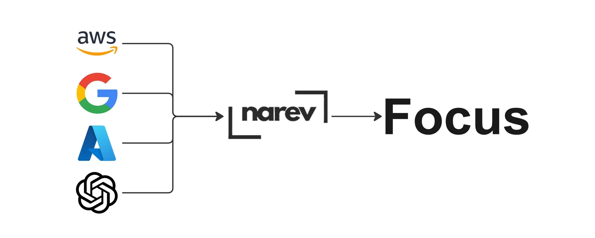

# `thin-ops`



## Convert any billing into FOCUS format

[](https://github.com/narevai/thin-ops/commits)
[](https://github.com/narevai/thin-ops/tags)
[](https://github.com/narevai/thin-ops)
[](LICENSE)

**thin-ops** is a self-hosted FinOps platform. It is built for tracking infrastructure spend and unifying it into a FOCUS format.


**Cloud platforms we support**:

- AWS
- Azure
- GCP
- OpenAI


## Quick Start

### Demo Mode (with sample data)

```bash
docker run -d \
  --name thin-ops \
  -p 8000:8000 \
  -v $(pwd)/data:/app/data \
  -e DEMO="true" \
  ghcr.io/narevai/thin-ops:latest
```

Then open <http://localhost:8000>.

### Production

First, generate an encryption key:

```bash
python -c "from cryptography.fernet import Fernet; \
print(Fernet.generate_key().decode())"
```

Then run the container with your generated key:

```bash
docker run -d \
  --name thin-ops \
  -p 8000:8000 \
  -v $(pwd)/data:/app/data \
  -e ENCRYPTION_KEY="replace-with-your-generated-fernet-key" \
  -e ENVIRONMENT="production" \
  ghcr.io/narevai/thin-ops:latest
```

Then open <http://localhost:8000>.

### Docker Compose

For a self-hosted install, you can also use Docker Compose:

```yaml
services:
  narev:
    image: ghcr.io/narevai/thin-ops:latest
    container_name: thin-ops
    ports:
      - "8000:8000"
    volumes:
      - ./data:/app/data
    environment:
      ENVIRONMENT: production
      ENCRYPTION_KEY: "replace-with-your-generated-fernet-key"
    restart: unless-stopped
```

Start it with:

```bash
docker compose up -d
```

Then open <http://localhost:8000>.

### Security

Thin-ops does not include built-in authentication yet. For production use, run it behind a reverse proxy, VPN, SSO/auth proxy, or another trusted access layer. Avoid exposing the container directly to the public internet.

- Full production setup in the [Deployment Guide](https://www.narev.ai/docs/narev-oss/getting-started/deployment).

## License

Apache 2.0

---

## Acknowledgments

Thanks to [@satnaing](https://github.com/satnaing) for the excellent [front end starter](https://github.com/satnaing/shadcn-admin/tree/main)
